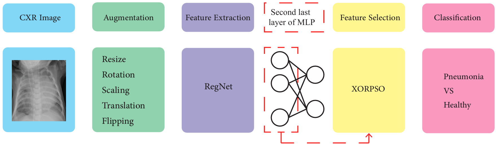

# XORPSO

This repository contains the implementation of the research described in the following paper:

**Title:** Optimized Deep Feature Selection for Pneumonia Detection: A Novel RegNet and XOR-Based PSO Approach

**Authors:** Fatemehsadat Ghanadi Ladani, Samaneh Hosseini Semnani

**Abstract:** Pneumonia remains a significant cause of child mortality, particularly in developing countries where resources and expertise are limited. The automated detection of Pneumonia can greatly assist in addressing this challenge. In this research, an XOR based Particle Swarm Optimization (PSO) is proposed
to select deep features from the second last layer of a RegNet model, aiming to improve the accuracy of the CNN model on Pneumonia detection. The proposed XOR PSO algorithm offers simplicity by incorporating just one hyperparameter for initialization, and each iteration requires minimal computation time. Moreover, it achieves a balance between exploration and exploitation, leading to convergence on a suitable solution. By extracting 163 features, an impressive accuracy level of 98% was attained which demonstrates comparable accuracy to previous PSO-based methods. The following diagram illustrates the pipeline:

## Code Overview

The code in this repository corresponds to the research presented in the paper. It includes implementations of the algorithms, experiments, and analysis conducted in the paper. You can find detailed explanations and usage instructions in the relevant directories.

## XOR PSO: A Binary Particle Swarm Optimization Algorithm

# Overview

XOR PSO is a modified Particle Swarm Optimization (PSO) algorithm tailored for discrete optimization problems, such as feature selection. Unlike conventional PSO designed for continuous spaces, XOR PSO uses binary vectors to represent solutions and employs XOR logic to update positions and velocities.

## Key Features
- **Binary Solution Representation**: Each position is a binary vector indicating selected features.
- **XOR Logic**: Captures the difference between personal best (\(P_{best}\)), global best (\(G_{best}\)), and current position (\(X\)).
- **Reduced Hyperparameters**: Simplifies the algorithm by eliminating or setting standard values for some parameters (e.g., \(C_1\) and \(C_2\)).
- **Discrete Optimization**: Efficiently explores binary solution spaces.

## Formulas

### Velocity Update
\[
V_{t+1} = W \cdot V_t + R_1 \cdot \text{XOR}(P_{best}, X_t) + R_2 \cdot \text{XOR}(G_{best}, X_t)
\]
- \(W\): Inertia weight (\(0 \leq W \leq 1\)).
- \(R_1\): Random factor (\(-1 \leq R_1 \leq 1\)).
- \(R_2\): Random factor (\(0 \leq R_2 \leq 1\)).

### Threshold Mapping
\[
V_{t+1} = 
\begin{cases} 
0 & \text{if } V_{t+1} < 0.5 \\
1 & \text{if } V_{t+1} \geq 0.5
\end{cases}
\]

### Position Update
\[
X_{t+1} = \text{XOR}(X_t, V_{t+1})
\]

## Advantages
- **Simplified Parameter Tuning**: No need for \(C_1\) and \(C_2\).
- **Effective for Feature Selection**: Specifically designed for binary optimization tasks.
- **Fewer Hyperparameters**: Reduces complexity compared to other swarm algorithms.

## How It Works
1. **Initialization**: Binary positions (\(X\)) and velocities (\(V\)) are initialized randomly.
2. **Velocity Update**: Update velocity using XOR logic, inertia weight, and random factors.
3. **Threshold Mapping**: Map \(V_{t+1}\) to binary values using a 0.5 threshold.
4. **Position Update**: Update positions using the XOR operation.
5. **Evaluation**: Calculate fitness and update \(P_{best}\) and \(G_{best}\).
6. **Repeat**: Continue until convergence or a termination condition is met.

## Applications
- **Feature Selection**: Selects the most relevant features in a dataset for machine learning models.
- **Discrete Optimization**: Solves problems where solutions are represented in binary form.
## Paper Reference

For further details, please refer to the full paper:

[Optimized Deep Feature Selection for Pneumonia Detection: A Novel RegNet and XOR-Based PSO Approach](https://arxiv.org/pdf/2309.00147.pdf)

